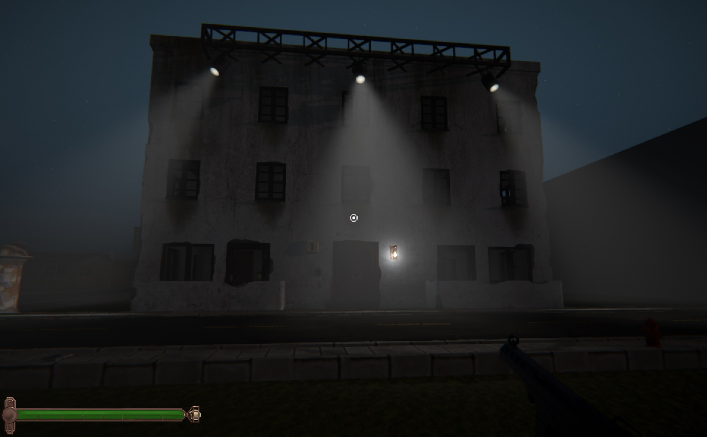

# 🏠 Saint Aveline: Survival Horror
   

  

## 🎮 Game Backstory

**Saint Aveline** is a tense survival experience set in the world of [Yanorra](https://github.com/DogFingerStudios/Yanorra). On the island of Saint Aveline—once a quiet refuge off Duvessa’s coast—war has arrived. As the mainland burns in civil conflict between the authoritarian **Dornish Order** and the insurgent **Sombra-Qhari Guerrillas**, the island’s fragile peace collapses overnight.

Players take the role of a father struggling to escape the siege with his wife, children, and elderly father. Trapped amid the occupation, the family must navigate shattered streets, scarce resources, and impossible moral choices. Every decision carries weight—each mistake could cost a life.

## Devlog

Follow the development journey on through my live streams at [YouTube](https://www.youtube.com/@AddyGoesLive).

## Key Features:
- First-Person ↔ Third-Person toggle
- Permadeath survival mechanics
- Basic stealth, combat, and detection systems
- Randomized NPC spawns and AI pursuit
- Dynamic terrain and procedural building logic
- WWII-inspired aesthetic with Andean mythological overtones

---

## 🧪 Technologies Used

| Tool / Engine | Purpose |
|---------------|---------|
| **Unity 6000.0.43f1** | Game engine |
| **C#** | Core gameplay logic and systems |
| **NavMesh Components** | AI pathfinding and navigation |
| **TextMeshPro** | UI and HUD systems |
| **Unity UI Toolkit** | Modern menus and HUD overlays |
| **Git** | Version control |

---

## 🎯 **Prototype Goals**

- ✅ Establish basic player movement (FPS + 3rd person toggle).
   - 🔹 <s>First Person</s>
   - 🔹 Third Person
   - 🔹 1st/3rd Person Toggle
- ✅ <s>Build a small portion of the tower (Ground Floor + 9th Floor + Roof).</s>
- ✅ Implement basic AI
   - 🔹 Patrol
   - 🔹 Chase
   - 🔹 Attack
- ✅ Create initial stealth and combat mechanics.
- ✅ Set up family NPCs with basic interaction and survival dynamics:
  - 🔹 Friendly NPCs (e.g., SonNPC) use a custom C# state machine
  - 🔹 States for POC: **Idle** (rotates to face player) and **Follow** (tracks player via NavMeshAgent)
- ✅ Establish basic ending conditions (reach the roof or kill all guards).

---

### 🏗️ **1. Foundation & Scene Setup**

1. **Create a New Unity Project**
   - Set up a 3D scene with default lighting
   - Import basic player model, camera, and controller

2. **Create Test Tower Layout**
   - Build 3 floors for testing:
     - 🛡️ **Ground Floor** – Sandbags, entry points, 1–2 guards
     - 🏠 **9th Floor** – Player apartment, family interaction
     - 🚁 **Roof** – Flare signal point
   - Use ProBuilder or modular building assets

3. **Lighting and Atmosphere**
   - Use dim lighting for tension
   - Add ambient war sounds (gunfire, footsteps, wind, etc)

---

### 🎮 **2. Player & Camera Setup**

1. **FPS and 3rd Person Controller**
   - Use `CharacterController`
   - Implement WASD + mouse look
   - Add jump and crouch
   - Toggle between FPS and 3rd-person modes

2. **Smooth Camera Transitions**
   - Use `Lerp` or `SmoothDamp`
   - Adjust FOV per perspective

---

### 👹 **3. AI and Enemy Mechanics**

1. **Basic AI States**
   - 🟢 Patrol – NavMesh-based pathing
   - 🟡 Alert – React to noise or sight
   - 🔴 Chase – Pursue player
   - ☠️ Attack – Trigger animation or damage

2. **Stealth Mechanics**
   - Raycast for enemy vision
   - Line-of-sight logic
   - Detection meter UI element

---

### 🏃 **4. Survival and Combat**

1. **Weapons**
   - Add knife or Molotov
   - Hit detection and damage logic

2. **Noise Distraction**
   - Player can generate sound (e.g. pututu horn)
   - AI reacts and enters alert state

---

### 👨‍👩‍👧‍👦 **5. Family Dynamics**

1. **Family AI**
   - 👦 Pachacuti (son) follows player, uses pututu
   - 👧 Kusi-Rose (daughter) crawls through vents
   - 👴 Túpac (grandfather) helps in combat

2. **Permadeath System**
   - Family death is permanent and impactful

---

### 🏆 **6. Victory and Failure Conditions**

1. **Victory**
   - 🚁 Reach roof and signal helicopter
   - ☠️ Eliminate all enemy guards

2. **Failure**
   - 💀 Player or essential family death
   - 🛑 Caught by enemy AI

---

### 🎯 **7. UI and Feedback**

1. ❤️ Health Bar for player/family
2. 👁️ Detection Meter (stealth feedback)
3. 🎒 Ammo/Inventory UI

---

### 🔥 **8. Playtesting and Refinement**

1. Test:
   - Stealth system (vision, noise)
   - AI behavior (patrol, chase, attack)
   - Combat feedback

2. Adjust difficulty and AI based on feedback

